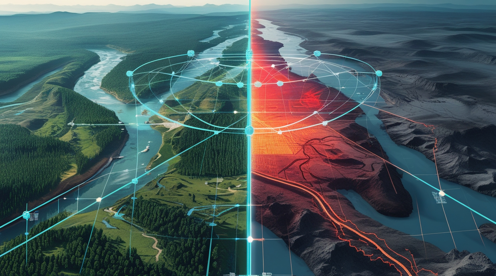
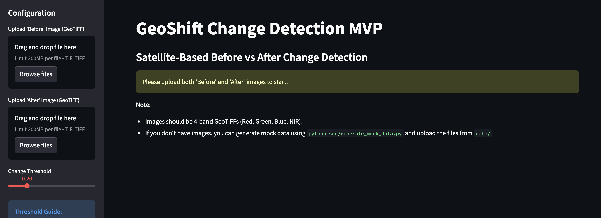
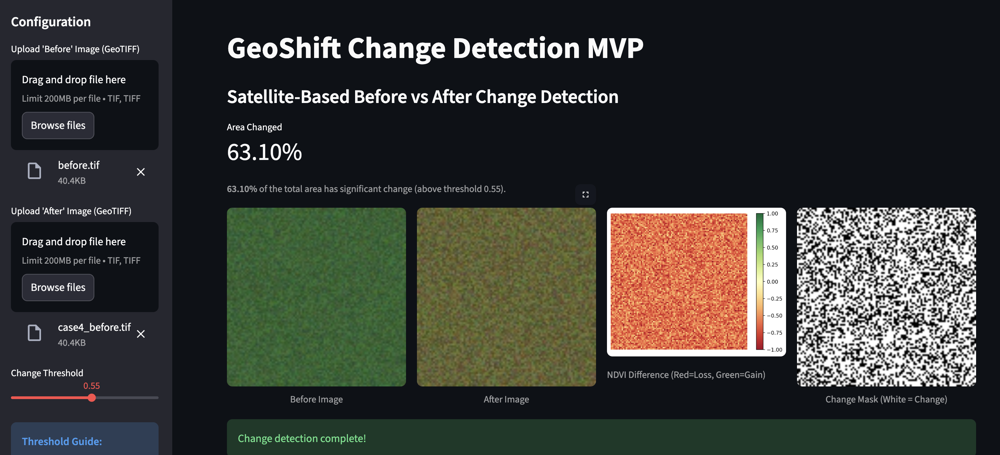
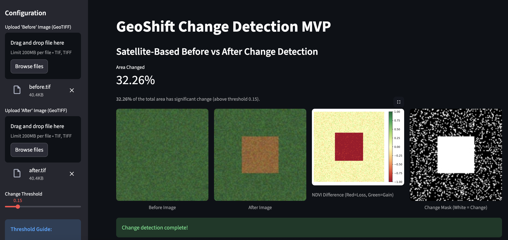

# GeoShift Change Detection
Satellite-Based Before vs After Change Detection using Geospatial ML


<p align="center">

  
</p>


## Overview
GeoShift is an MVP system that detects and visualizes landscape changes using multi-temporal satellite imagery.
By comparing “Before vs After” scenes, the system automatically highlights areas that have undergone transformations such as:

✔ Deforestation
✔ New constructions & roads
✔ Water body shrinkage
✔ Urban expansion
✔ Agricultural land-use shift

The project demonstrates **remote sensing + machine learning + temporal analysis**, making it suitable for environmental monitoring & geospatial AI portfolios.

> 📚 [Read the full story on Medium](https://sukriti-speaks.medium.com/geoshift-automated-landscape-intelligence-from-space-aefe3099a9bb?postPublishedType=initial)

---
## Streamlit App Demo

Below is the visual interface of the GeoShift app detecting landscape changes using uploaded satellite images:

<p align="center">  <br> <em>Home Screen — Upload Before/After imagery</em> </p>  

<p align="center">
  
  
</p> 

---

## Key Features

| Module | Capability |
|-------|------------|
| Data Acquisition | Upload "Before" and "After" GeoTIFF images |
| Pre-processing | Basic raster alignment (reprojection) |
| Change Detection Engine | Spectral Change Detection (NDVI Differencing) |
| Visualization Layer | Difference Heatmaps + Change Masks + Side-by-Side Comparison |
| Output Metrics | % Area Changed, GeoTIFF Mask Export |

---

## <a href="https://youtube.com/playlist?list=PLUlKq_lSKQiOMmrHGozPlZOLDXdEVa5z_&si=6dBwr8bGupUUI7S-" target="_blank">  YouTube Series: Building GeoShift</a>

> This repository is accompanied by a YouTube Shorts series titled **“Building GeoShift: Geospatial ML Project.”** 

The objective of the series is to document and explain the complete journey of the GeoShift project in a simple and practical way — covering:

1. What GeoShift is and the problem it solves
2. Why automated land-change detection is important
3. How satellite imagery and machine learning are used
4. Technical decisions behind the MVP
5. Real-world use cases and future possibilities

The series is designed to break down complex geospatial and AI concepts into short, easy-to-understand 30-second episodes.


## <a href="https://youtube.com/playlist?list=PLUlKq_lSKQiOMmrHGozPlZOLDXdEVa5z_&si=6dBwr8bGupUUI7S-"> Playlist</a>
## <a href="https://www.youtube.com/channel/UC9QJnm18hr2fBB5-BPXVv3w"> Channel</a>

📅 **New episodes are uploaded every Monday.**

Follow along to see how GeoShift evolves from idea to implementation!


---

### **Spectral Change Detection (MVP baseline)**
- Compute NDVI/NDWI/NBR for both timestamps
- Generate difference raster: `delta = im_after - im_before`
- Threshold differences to create change mask
- Overlay mask on original scene for visualization

<!-- ### Option B — **Siamese Change Detection Model (Advanced)**
```
Image T1 → CNN Encoder ─┐
│→ Feature Difference → Upsampling Decoder → Change Mask
Image T2 → CNN Encoder ─┘
```
Loss Used: **Binary Cross Entropy + Dice**
Output: Pixel-level change classification heatmap -->

---

## Tech Stack


| Category | Tools |
|---|---|
| Language | Python |
| Geospatial Processing | Rasterio, NumPy |
| ML / CV | OpenCV, Matplotlib |
| Data Source | User Upload / Synthetic Mock Data |
| Visualization | Streamlit |
| Deployment | Local Streamlit Server |

---

## Project Structure
```
GeoShift-Change-Detection/
│── data/               # input imagery + output masks
│── src/
│   ├── preprocessor.py       # image alignment + band extraction
│   ├── differencer.py        # NDVI change computation
│   ├── generate_mock_data.py # synthetic data generator
│   ├── debug_ndvi.py         # debug script for NDVI values
│   ├── test_differencer.py   # unit tests for differencer
│── results/            # heatmaps, overlays, reports
│── app.py              # Streamlit frontend
│── requirements.txt    # dependencies
│── README.md
```

---

## How to Run
```bash
# 1. Clone the repository
git clone https://github.com/SukritiC/GeoShift-Change-Detection.git
cd GeoShift-Change-Detection

# 2. Install dependencies
pip install -r requirements.txt

# 3. Generate mock data (Optional, for testing)
python src/generate_mock_data.py

# 4. Run the application
streamlit run app.py
```

## License

This documentation and conceptual content are distributed under the **Apache License**.
See the [LICENSE](./LICENSE) file for more information.

---
## Connect with Me

I’m always open to connecting with **developers**, **AI enthusiasts**, and **innovators** working on **Generative AI projects**.
Let’s connect, collaborate, and create impact together!

<p align="center">
  <a href="https://www.linkedin.com/in/sukritichatterjee/" target="_blank" style="margin-right: 15px;">
    
  </a>
  <a href="https://github.com/SukritiC" target="_blank" style="margin-right: 15px;">
    
  </a>
   <a href="https://sukriti-speaks.medium.com/" target="_blank" style="margin-right: 15px;">
    
  </a>
  <a href="https://x.com/SukritiSpeak" target="_blank">
    
  </a>
</p>

---

<p align="center">
  Let’s exchange ideas on <b>Generative AI</b> and build something extraordinary together. 🌍
</p>

---
